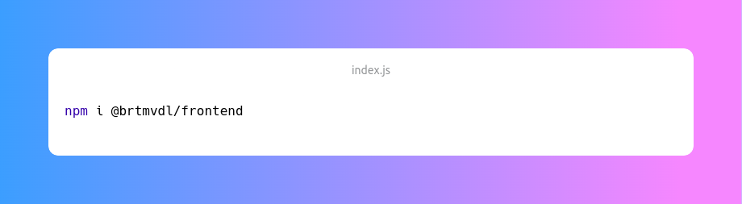
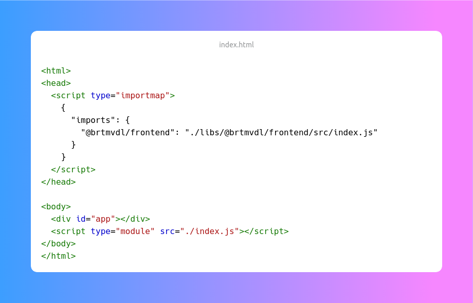

# [@brtmvdl/frontend](https://www.npmjs.com/package/@brtmvdl/frontend)

Easy Front-end Node.js library

   

## social & donate

[Donate](https://link.mercadopago.com.br/brtmvdl) - [Telegram](https://t.me/+KRmg5MlqgMk0MTg5) - [Discord](https://discord.gg/auCmnvV2)

## install

## how to use

## License

[MIT](./LICENSE)
